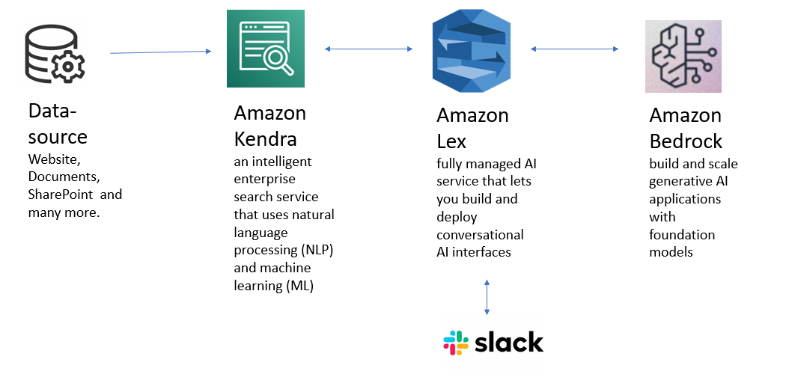

- Automation of Cross-Walk for TMA
- POD Scaling for LAUSD: 
	- Some kind of multi-user testing was required. Fear was that session and data could get messed up because of session sharing for MTSS application. 
	- There were pod level configuration changes in order to scale the application. Kind of load balancer was implemented for this. (get more details on what exactly is done on this to resolve this.) 27K Staff / Teachers. One of our largest customer for Analytics customers. We are certified for 5K Users. 
		- Networking tool ISTIO Sticky session is implemented. AWS Load balancer was also tried. sticky session means a given session will always go to a certain pod. This is required part of architecture of Portal because of session related information and local cache within each pod. 
		- Script is created to create separate fileshare/ caching folders in EFS for each pod. This was the major change required. 
		- Team still need to add auto-clean up of these folders. 
	- Another problem team is working on is scaling EFS: Access points are limited 
		- EFS: Number of access points is limited to 1000. 
		- For Alabama its already 450. For Montana it will cross 1000 since its approx 3-4 

RAG Based model 
- AWS Kendra 
- Amazon Lex 
- Amazon Bedrock 

- Security Ticket Identification 
- ETL Statuses from Builds. Improving Observability 
- Teams enabled unread and pinning functionality in MTSS Applications
